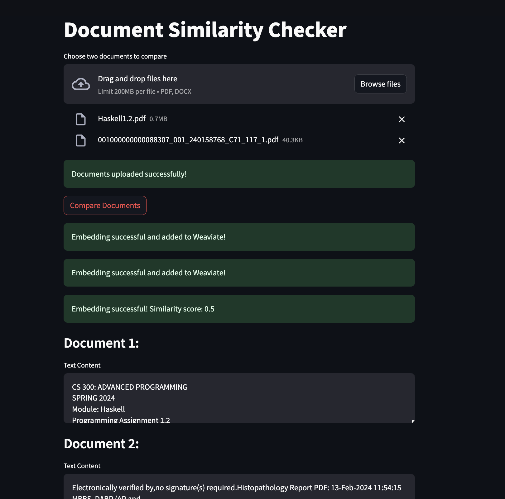

## Introduction

The Document Similarity Checker is a Python application that utilizes natural language processing techniques to compare the similarity between two documents. It supports PDF and DOCX file formats. It uses Hugging Face maidalun1020/bce-embedding-base_v1 model to generate embeddings for the documents and then uses cosine similarity to compare the similarity between the documents. Embeddings once generated are added to Weaviate, a vector search engine, to enable fast and efficient search.

## Installation

1. Clone the repository:
   ```shell
   git clone https://github.com/RamishRasool14/Document-Similarity.git
   cd document-similarity-checker
    ```

2. Add your Hugging Face API key to docker compose HF_API_KEY environment variable. You can get the API key for free [here](https://huggingface.co/docs/api-inference/en/quicktour)
   ```shell
   echo "HF_API_KEY=your_api_key" > .env
   ```

3. Docker:
   ```shell
    docker compose up
    ```

You can now access the application at http://localhost:8501